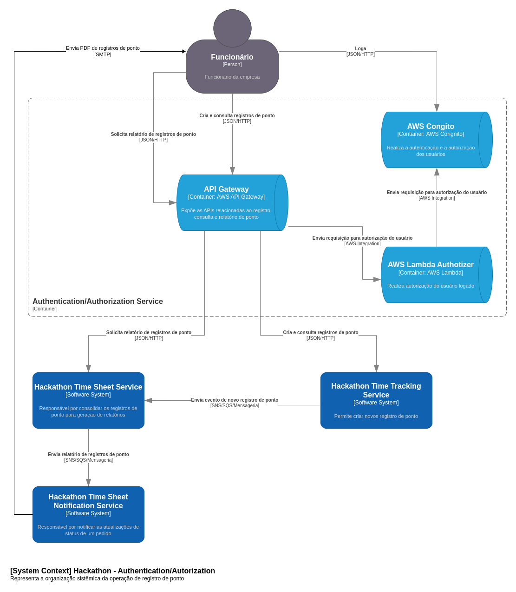
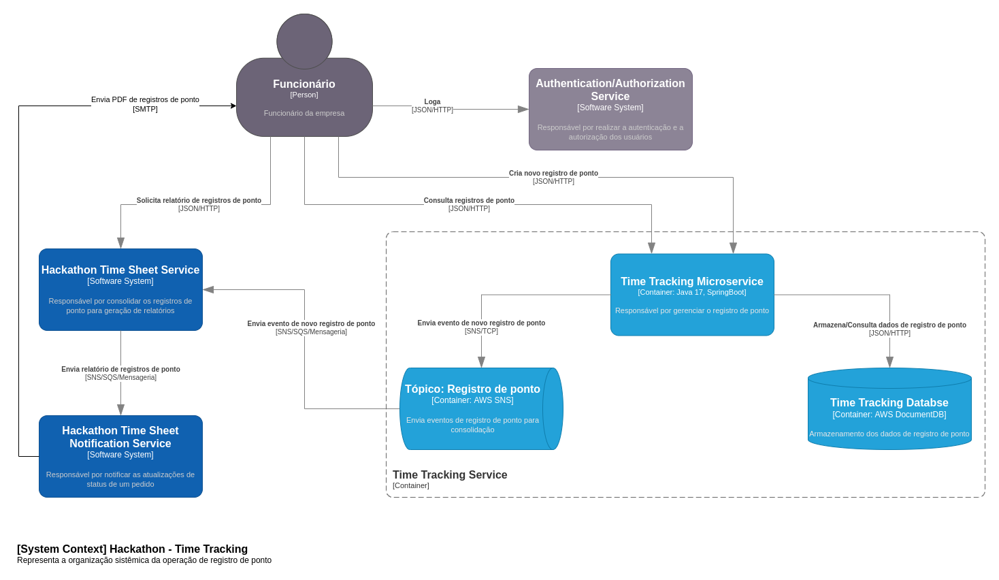
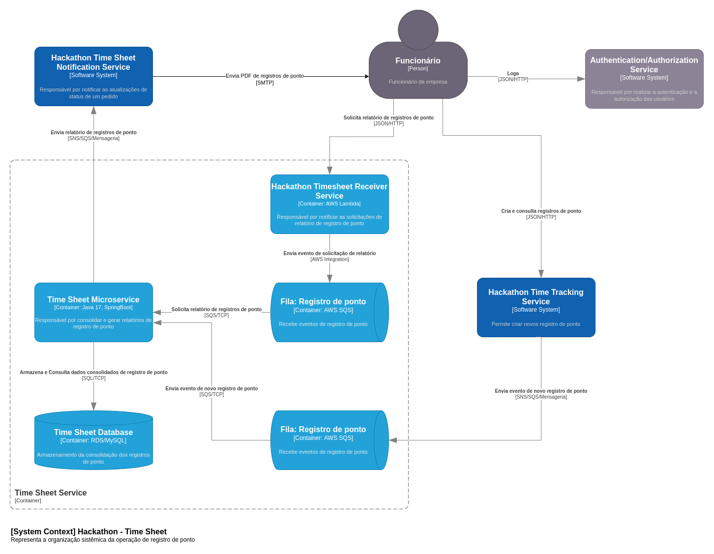
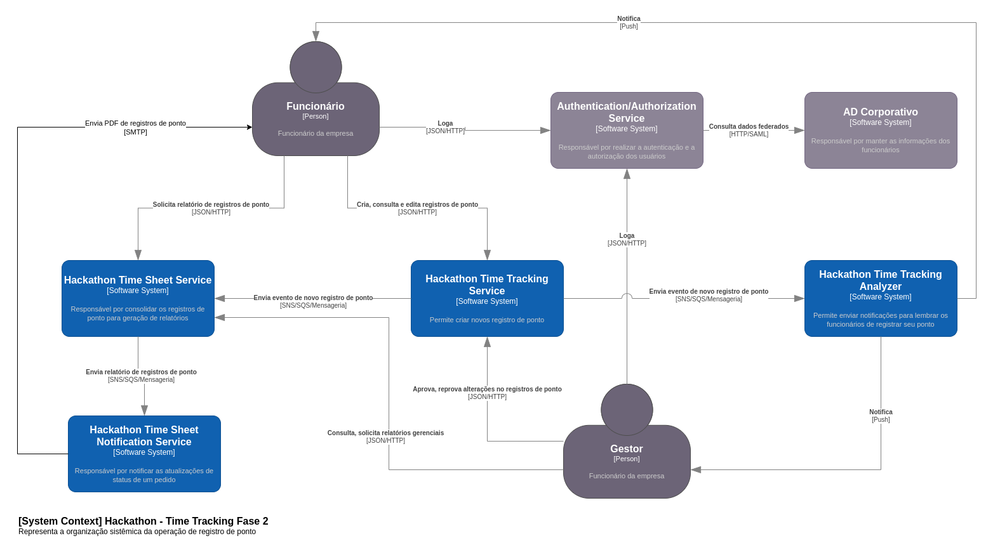

# Hackathon Pos-Tech - Fiap

## Tópicos

- [Hackathon Pos-Tech - Fiap](#hackathon-pos-tech---fiap)
  - [Problema](#problema)
  - [Descrição do Sistema](#descrição-do-sistema)
  - [Arquitetura](#arquitetura)
    - [Visão Geral](#visão-geral)
    - [Authentication/Authotization Service](#authentication-and-authotization-service)
    - [Time Tracking Microservice](#time-tracking-microservice)
    - [Time Sheet Microservice](#time-sheet-microservice)
    - [Visão Geral Fase 2](#visão-geral-fase-2)
    - [Postman Collection](#postman-collection)

## Problema
A Hackaton Company SA, uma empresa de grande porte com mais de 100.000 colaboradores e que atende diversas áreas, inclusive tecnologia, está em um ponto de transição crucial. Atualmente, está utilizando um sistema de ponto eletrônico terceirizado, mas devido a questões de qualidade e custos mensais significativos por usuário, a diretoria decidiu por construir o próprio sistema de ponto eletrônico interno. E, para que atenda as diversas filiais e pontos de trabalho dos colaboradores, este novo sistema será baseado em nuvem.

A decisão de migrar para um sistema interno e em nuvem é motivada por várias razões. A primeira é relacionada à qualidade do serviço fornecido pelo sistema terceirizado, que tem sido insatisfatória, com problemas frequentes de desempenho e disponibilidade. Somando-se a isso, os custos mensais por usuário estão se tornando proibitivos, especialmente considerando a quantidade de colaboradores. E outro ponto importante é a possibilidade de controlar a evolução do software implementando as melhorias necessárias sempre que desejado.

Ao construir o próprio sistema em nuvem, espera-se não apenas economizar custos no longo prazo, mas também melhorar a qualidade e a confiabilidade do registro de ponto para os colaboradores. A nuvem oferece benefícios significativos em termos de escalabilidade, disponibilidade e segurança, tornando-a a escolha ideal para o novo sistema.

Este projeto envolverá a criação de um sistema de ponto eletrônico robusto, escalável e seguro que possa suportar a carga de nossa grande força de trabalho. O novo sistema irá implementar as funcionalidades do sistema atual, e terá uma série de recursos adaptados à realidade da nossa empresa, incluindo a autenticação de usuário, registro de ponto, visualização e edição de registros, geração de relatórios, notificações e integração com outros sistemas.

A transição para a nuvem é um passo importante para o início de grandes modernizações dentro da organização.

## Descrição do Sistema
Sistema de gerenciamento de registro de ponto, este sistema tem como objetivo permitir que a Hackaton Company SA possa atender os seus funcionários de maneira eficiente, gerenciando seus registro de ponto para viabilizar uma gestão mais adequada.

## Arquitetura
_________________
### Visão Geral

_________________

### Authentication and Authotization Service

[Authorizer - Repositório da Lambda](https://github.com/fiap-postech/hackathon-cognito-authorizer)

_________________

### Time Tracking Microservice

[Time Tracking - Repositório do Serviço](https://github.com/fiap-postech/hackathon-time-tracking-microservice)

_________________

### Time Sheet Microservice

[Time Sheet - Repositório do Serviço](https://github.com/fiap-postech/hackathon-timesheet-microservice)

[Time Sheet Receiver - Repositório da Lambda](https://github.com/fiap-postech/hackathon-timesheet-receiver)

[Time Sheet Notification - Repositório da Lambda](https://github.com/fiap-postech/hackathon-timesheet-notification-service)

_________________
### Visão Geral Fase 2

_________________

## Postman Collection

Utilize a collection do Postman que se encontra em: [Hackathon API.postman_collection](./doc/postman/Hackathon.postman_collection.json) juntamente com o arquivo de environment: [hackathon.postman_environment](./doc/postman/hackathon.postman_environment.json) para realizar as requisições nos serviços.